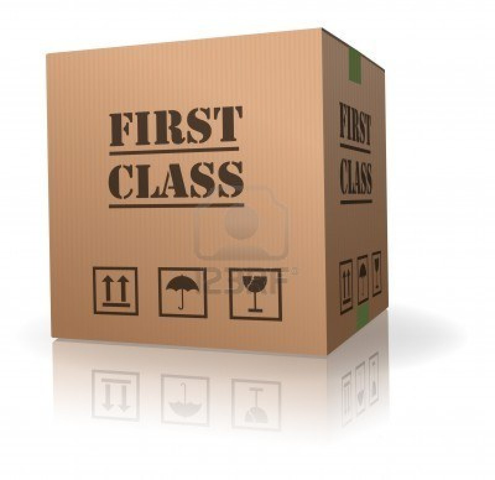

# CocoaPods 💥

## Capital One, September 2015

### Boris Bügling - @NeoNacho

### Samuel Giddins - @segiddins


<!--- use Next theme, white -->

---

# CocoaPods 0.38


---

# support for watchOS

```ruby
Pod::Spec.new do |s|
  # …
  s.watchos.deployment_target = '2.0'
end
```


---

# Target Deduplication

Happens by default, exceptions:

* They are used on different platforms.
* They are used with differents sets of subspecs.
* They have any dependency which needs to be duplicated.


---

# Breaking Change to the Hooks-API

```ruby
post_install do |installer_or_rep|
  # @note: Remove after CocoaPods 0.38+ is completely rolled out
  # and rename block argument to `installer`.
  installer = installer_or_rep.respond_to?(:installer) ? 
    installer_or_rep.installer : installer_or_rep

  # You can use the installer from now on.
end
```


---

# Split of `xcconfig`

- `pod_target_xcconfig`
- `user_target_xcconfig`


---

# Other changes

- Removal of the Enviroment Header
- Deterministic UUIDs by Xcodeproj
- Resolver takes the Deployment Target into account


---

## Make sure you check out `blog.cocoapods.org` and the `CHANGELOG` for major releases


---

# CocoaPods 0.39

- currently beta 4
- Vendored dynamic frameworks 🎉
- `--private` option for linting (ignore warnings only suitable for trunk)
- `HEADER_SEARCH_PATHS` is no longer constructed recursively


---

# CocoaPods plugins

- Add subcommands to `pod`, the tool
- `post_install` hook
- Each plugin is a Gem


---

## Do whatever you want, because Ruby 💎


---

# Useful plugins


---

```bash
$ pod plugins list
```


---

```bash 
$ pod keys set AccessToken 0xFFFFFFFF
```


---

```bash
$ pod package ContentfulDeliveryAPI.podspec
```



---

```bash
$ pod lib coverage
```


---

```bash 
$ pod roulette
```


--- 

# How to build your own plugin


---

```bash
$ pod plugins create cocoapods-awesome-plugin
```


---

```bash
$ tree
.
├── Gemfile
├── LICENSE.txt
├── README.md
├── Rakefile
├── cocoapods_awesome_plugin.gemspec
└── lib
    ├── cocoapods_awesome_plugin.rb
    ├── cocoapods_plugin.rb
    └── pod
        └── command
            └── plugin.rb

3 directories, 8 files
```


---

```ruby
module Pod
  class Command
    class Plugin < Command
      self.summary = "Short description."

      self.arguments = [CLAide::Argument.new('NAME', true)]

      def initialize(argv)
        @name = argv.shift_argument
        super
      end

      def validate!
        super
        help! "A Pod name is required." unless @name
      end

      def run
        UI.puts "Add your implementation here"
      end
```


---

# Hooks


---

```ruby
Pod::HooksManager.register(:post_install) do |options|
  require 'installer'

  UI.puts "This gets executed after installation"
end
```


---

# Dealing With 🐛s


---

- Does it happen only in my project?
- Can I make it happen without custom settings?
- Work around it via a post-install script
- Submit an issue


---

## Submitting an Issue

- Following the contributing guidelines
- State which of the above you've done
- Make sure you're not leaving out a key piece of info
- Don't file dupes, don't 👍


---

The easier you make it for us to fix a bug, the faster it will get fixed.


---

# Road to 1.0


---

_Long_ road to 1.0


---

CocoaPods == Stable


---

CocoaPods == Stable __*__

__*__ For 99% of users


---

_2_ major changes


---

## Major Changes

# Customizable Installation


---

## Customizable Installation

- ~~`--no-integrate`~~
- Same default
- Pass options to the installer


---

## Major Changes

# Target Inheritance


---

## Target Inheritance

- ~~`:exclusive => true`~~
- New options
    - Complete
    - Search paths
    - None


---

## Target Inheritance

- Allows test targets to work
- Allows for more 'logical' Podfiles


---

# 1.0


---

# Our promise we won't intentionally break things


---

## Coming this fall


---

## Coming this fall

Hopefully


---

# Thank you!


---

## @NeoNacho

## @segiddins

### cocoapods.org


