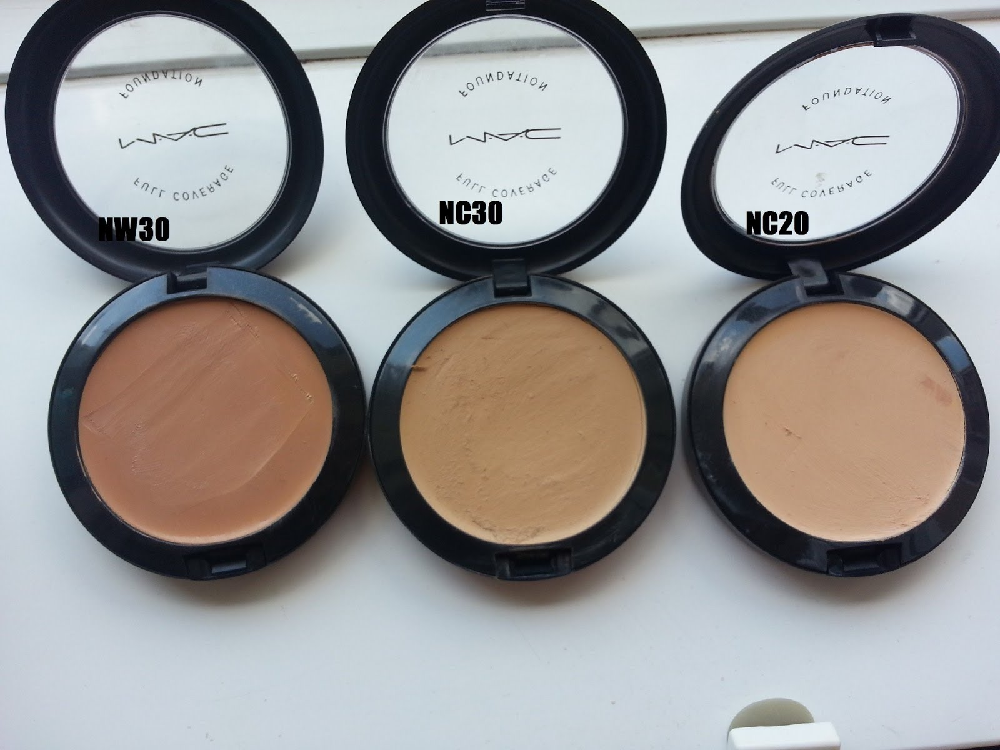
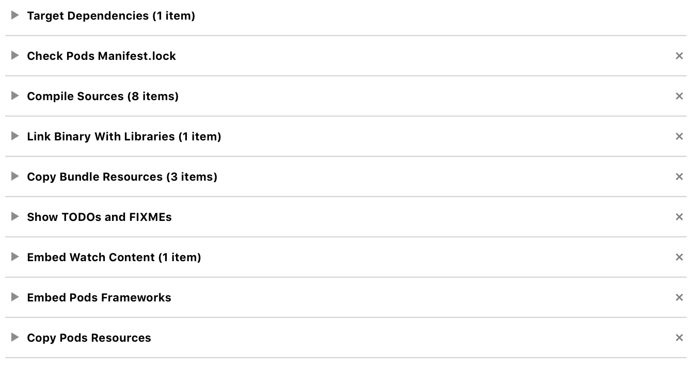

# CocoaPods 💥

## iOSDevCampDC, September 2015

### Boris Bügling - @NeoNacho


<!--- use Next theme, white -->

---

## CocoaPods


---

## Contentful


---

# Agenda

- What's new and upcoming
- CocoaPods plugins
- How does CocoaPods even
- Troubleshooting and Tips


---

# What's new and upcoming


---

# CocoaPods 0.38


---

# support for watchOS

```ruby
Pod::Spec.new do |s|
  # …
  s.watchos.deployment_target = '2.0'
end
```


---

# Target Deduplication

Happens by default, exceptions:

* They are used on different platforms.
* They are used with differents sets of subspecs.
* They have any dependency which needs to be duplicated.


---

# Breaking Change to the Hooks-API

```ruby
post_install do |installer_or_rep|
  # @note: Remove after CocoaPods 0.38+ is completely rolled out
  # and rename block argument to `installer`.
  installer = installer_or_rep.respond_to?(:installer) ? 
    installer_or_rep.installer : installer_or_rep

  # You can use the installer from now on.
end
```


---

# Split of `xcconfig`

- `pod_target_xcconfig`
- `user_target_xcconfig`


---

# Other changes

- Removal of the Enviroment Header
- Deterministic UUIDs by Xcodeproj
- Resolver takes the Deployment Target into account


---

## Make sure you check out `blog.cocoapods.org` and the `CHANGELOG` for major releases


---

# CocoaPods 0.39

- currently beta 4
- Vendored dynamic frameworks 🎉
- `--private` option for linting (ignore warnings only suitable for trunk)
- `HEADER_SEARCH_PATHS` is no longer constructed recursively


---

# Road to 1.0


---

## Major Changes

# Customizable Installation


---

## Customizable Installation

- ~~`--no-integrate`~~
- Same default
- Pass options to the installer


---

## Major Changes

# Target Inheritance


---

## Target Inheritance

- ~~`:exclusive => true`~~
- New options
    - Complete
    - Search paths
    - None


---

## Target Inheritance

- Allows test targets to work
- Allows for more 'logical' Podfiles


---

## Coming this fall

Hopefully


---

# CocoaPods plugins


---

# CocoaPods plugins

- Add subcommands to `pod`, the tool
- `post_install` hook
- Each plugin is a Gem


---

## Do whatever you want, because Ruby 💎


---

# Useful plugins


---

```bash
$ pod plugins list
```


---

```bash 
$ pod keys set AccessToken 0xFFFFFFFF
```


---

```bash
$ pod package ContentfulDeliveryAPI.podspec
```


---

```bash
$ pod lib coverage
```



---

```bash 
$ pod roulette
```


--- 

# How to build your own plugin


---

```bash
$ pod plugins create cocoapods-awesome-plugin
```


---

```bash
$ tree
.
├── Gemfile
├── LICENSE.txt
├── README.md
├── Rakefile
├── cocoapods_awesome_plugin.gemspec
└── lib
    ├── cocoapods_awesome_plugin.rb
    ├── cocoapods_plugin.rb
    └── pod
        └── command
            └── plugin.rb

3 directories, 8 files
```


---

```ruby
module Pod
  class Command
    class Plugin < Command
      self.summary = "Short description."

      self.arguments = [CLAide::Argument.new('NAME', true)]

      def initialize(argv)
        @name = argv.shift_argument
        super
      end

      def validate!
        super
        help! "A Pod name is required." unless @name
      end

      def run
        UI.puts "Add your implementation here"
      end
```


---

# Hooks


---

```ruby
Pod::HooksManager.register(:post_install) do |options|
  require 'installer'

  UI.puts "This gets executed after installation"
end
```


---

# How does CocoaPods even


---

# `use_frameworks!`


---

# Build Phases




---

# Check Pods Manifest.lock

```bash
diff "${PODS_ROOT}/../Podfile.lock" "${PODS_ROOT}/Manifest.lock" > /dev/null
if [[ $? != 0 ]] ; then
    cat << EOM
error: The sandbox is not in sync with the Podfile.lock. 
Run 'pod install' or update your CocoaPods installation.
EOM
    exit 1
fi
```


---

# Link Binary With Libraries

- Links the aggregate framework
- Gets build via implicit dependencies


---

# Radar 22392501

> Actual Results:
> It doesn't. You receive this error when archiving:
> [...]
> So, because they have the same product name, _they're overriding each other_.
> How are we supposed to use our own frameworks from our different target types?


---

# Embed Pods Frameworks

- Copies the frameworks to the application bundle


---

# Copy Pods Resources

- Copies resources to the application bundle


---

# Troubleshooting


---

# Mixing Objective-C and Swift in a Pod

- Frameworks can't have a separate bridging header
- Objective-C headers can be included in the umbrella header


---

# First solution: module imports

```swift
import ObjectiveCPod
```

=> You get the full public API


---

# Second solution: publiclize all the things

- Create a header
- Import all the Objective-C headers you need
- Add that header to `public_header_files`

=> Exposes the dependency in the public API


---

# Third solution: custom module map

- Module maps can have private submodules

```
framework module ResearchKit {
    umbrella header "ResearchKit.h"
    
    module Private {
        umbrella header "ResearchKit_Private.h"
        export *
    }
    
    export *
    module * { export * }
}
```

- Can be declared in the podspec with `module_map`


---

# Reset your integration

```bash
$ gem install cocoapods-deintegrate
$ pod deintegrate
$ pod install
```


---

# `rm -rf $HOME/Library/Developer/Xcode/DerivedData`


---

# Filing issues

- Read our contribution guidelines
- Try if your problem reproduces in a separate project
- Give us that project!

=> Help us help you


---

# It gets *really* old creating countless projects every day :)


---

# Tips


---

# Use bundler to pin your used CocoaPods version

```bash
$ cat Gemfile
source 'https://rubygems.org'

gem 'cocoapods', '= 0.36.0.beta.1'
$ bundle install
$ bundle exec pod install # from now on
```


---

# Make sure your dependencies don't go away

- Commit the `Pods` directory
- Mirror your Pods (<https://github.com/xing/XNGPodsSynchronizer>)


---

# You can keep the Pods history separate

- Create an orphaned branch on your repo
- Check it out as a submodule to `Pods`
- History is now completely separate


---

# Automate your workflow

- Use plugins
- Use a Rakefile or Makefile for common tasks
- Use `pre_install` or `post_install` hooks in the Podfile


---

# Thank you!


---

@NeoNacho

boris@contentful.com

http://buegling.com/talks


